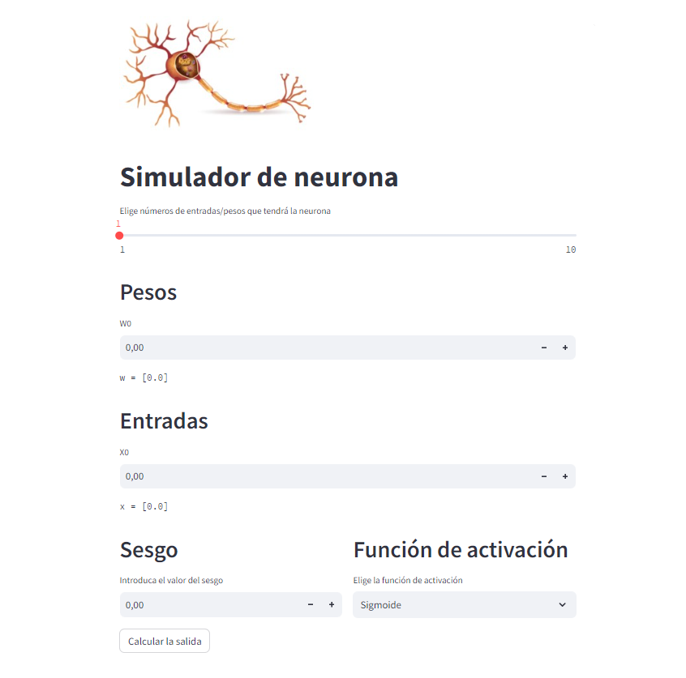

# Simulador de neurona
Aplicación hecha en Streamlit para implementar la clase Neuron.

[URL página](https://simuladorneurona.streamlit.app/)

## Clase Neuron
Esta clase permite instanciar neuronas con un vector de pesos, un sesgo y una determinada función de activación.

## Contenido
Se puede elegir el número de entradas y pesos que tendrá la neurona. Estos y el sesgo se pueden ir cambiando. Además, dado un vector de entrada, la neurona es capaz de dar la salida aplicando una de estas funciones de activación:
* Función sigmoide
* Función RELU
* Tangente hiperbólica

